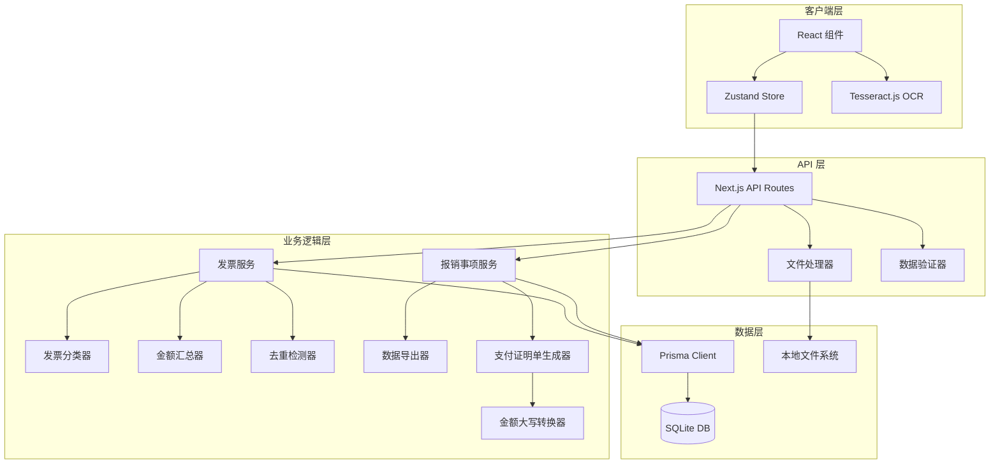

# 发票报销预审批系统 - 技术设计文档

## 概述

发票报销预审批系统是一个基于 Next.js 16 的全栈 Web 应用，旨在简化个人报销流程。系统通过 Tesseract.js OCR 技术自动识别发票金额，支持发票分类、金额汇总和支付证明单生成，所有数据存储在本地 SQLite 数据库中，发票文件保存在本地文件系统。Next.js 16 基于 React 19，提供了更好的性能和开发体验。

### 核心功能

- 报销事项管理（创建、编辑、删除、查询）
- 发票上传（单个/批量/拖拽，支持 PDF 和图片格式）
- OCR 自动识别发票金额
- 智能发票分类（交通费、餐饮费、住宿费、办公用品、其他）
- 金额汇总和分类统计
- 发票去重检测
- 数据导出（Excel、PDF）
- 支付证明单生成和打印
- 移动端响应式设计

### 技术栈

- **前端框架**: Next.js 16 (App Router, 基于 React 19)
- **UI 组件**: shadcn/ui + Tailwind CSS
- **状态管理**: Zustand
- **数据库**: Better-SQLite3 + Prisma ORM
- **OCR 引擎**: Tesseract.js (客户端)
- **文件处理**: 本地文件系统
- **数据导出**: xlsx (Excel), jsPDF (PDF)
- **类型安全**: TypeScript
- **包管理器**: pnpm

## 架构

### 系统架构图



### 架构层次

1. **客户端层**: 负责 UI 渲染、用户交互和客户端 OCR 处理
2. **API 层**: 提供 RESTful API 端点，处理请求验证和文件上传
3. **业务逻辑层**: 实现核心业务逻辑，包括分类、汇总、去重等
4. **数据层**: 负责数据持久化和文件存储

### 关键设计决策

1. **客户端 OCR**: 使用 Tesseract.js 在浏览器端进行 OCR 识别，避免服务器负载，保护用户隐私
2. **本地存储**: 使用 SQLite 和本地文件系统，适合个人使用场景，无需云服务
3. **App Router**: 采用 Next.js 16 App Router（基于 React 19），利用服务器组件和最新的并发渲染特性提升性能
4. **类型安全**: 全栈 TypeScript + Prisma 确保端到端类型安全
5. **响应式优先**: 移动端优先设计，确保在各种设备上的可用性

## 组件和接口

### 前端组件结构

```
app/
├── layout.tsx                    # 根布局
├── page.tsx                      # 首页（报销事项列表）
├── items/
│   ├── [id]/
│   │   └── page.tsx             # 报销事项详情页
│   └── new/
│       └── page.tsx             # 创建报销事项页
└── api/
    ├── items/
    │   ├── route.ts             # GET /api/items, POST /api/items
    │   └── [id]/
    │       ├── route.ts         # GET/PUT/DELETE /api/items/:id
    │       └── invoices/
    │           └── route.ts     # POST /api/items/:id/invoices
    ├── invoices/
    │   └── [id]/
    │       ├── route.ts         # GET/PUT/DELETE /api/invoices/:id
    │       └── preview/
    │           └── route.ts     # GET /api/invoices/:id/preview
    ├── export/
    │   └── [id]/
    │       ├── excel/
    │       │   └── route.ts     # GET /api/export/:id/excel
    │       └── pdf/
    │           └── route.ts     # GET /api/export/:id/pdf
    └── voucher/
        └── [id]/
            └── route.ts         # GET/PUT /api/voucher/:id

components/
├── ui/                          # shadcn/ui 组件
├── ReimbursementList.tsx        # 报销事项列表
├── ReimbursementDetail.tsx      # 报销事项详情
├── InvoiceUploader.tsx          # 发票上传组件
├── InvoiceList.tsx              # 发票列表
├── InvoiceCard.tsx              # 发票卡片
├── AmountSummary.tsx            # 金额汇总组件
├── PaymentVoucher.tsx           # 支付证明单组件
└── OCRProcessor.tsx             # OCR 处理组件

lib/
├── prisma.ts                    # Prisma 客户端实例
├── ocr.ts                       # OCR 工具函数
├── classifier.ts                # 发票分类器
├── aggregator.ts                # 金额汇总器
├── detector.ts                  # 去重检测器
├── exporter.ts                  # 数据导出器
├── voucher.ts                   # 支付证明单生成器
├── amount-converter.ts          # 金额大写转换器
└── file-handler.ts              # 文件处理工具

store/
└── reimbursement-store.ts       # Zustand 状态管理
```

### API 接口定义

#### 报销事项 API

```typescript
// POST /api/items - 创建报销事项
interface CreateItemRequest {
  title?: string;
  notes?: string;
}

interface CreateItemResponse {
  id: string;
  title: string;
  notes: string | null;
  createdAt: string;
  updatedAt: string;
}

// GET /api/items - 获取报销事项列表
interface GetItemsResponse {
  items: Array<{
    id: string;
    title: string;
    notes: string | null;
    createdAt: string;
    updatedAt: string;
    invoiceCount: number;
    totalAmount: number;
  }>;
}

// GET /api/items/:id - 获取报销事项详情
interface GetItemDetailResponse {
  id: string;
  title: string;
  notes: string | null;
  createdAt: string;
  updatedAt: string;
  invoices: Invoice[];
  summary: AmountSummary;
}

// PUT /api/items/:id - 更新报销事项
interface UpdateItemRequest {
  title?: string;
  notes?: string;
}

// DELETE /api/items/:id - 删除报销事项
// 返回 204 No Content
```

#### 发票 API

```typescript
// POST /api/items/:id/invoices - 上传发票
interface UploadInvoiceRequest {
  files: File[]; // multipart/form-data
}

interface UploadInvoiceResponse {
  success: Array<{
    id: string;
    fileName: string;
    fileSize: number;
    fileType: string;
    filePath: string;
    amount: number | null;
    category: InvoiceCategory;
    ocrStatus: 'pending' | 'processing' | 'success' | 'failed';
    createdAt: string;
  }>;
  failed: Array<{
    fileName: string;
    error: string;
  }>;
}

// GET /api/invoices/:id - 获取发票详情
interface GetInvoiceResponse {
  id: string;
  fileName: string;
  fileSize: number;
  fileType: string;
  filePath: string;
  amount: number | null;
  category: InvoiceCategory;
  ocrStatus: string;
  ocrText: string | null;
  createdAt: string;
  updatedAt: string;
  reimbursementItemId: string;
}

// PUT /api/invoices/:id - 更新发票信息
interface UpdateInvoiceRequest {
  amount?: number;
  category?: InvoiceCategory;
}

// DELETE /api/invoices/:id - 删除发票
// 返回 204 No Content

// GET /api/invoices/:id/preview - 预览发票文件
// 返回文件流
```

#### 导出 API

```typescript
// GET /api/export/:id/excel - 导出为 Excel
// 返回 Excel 文件流

// GET /api/export/:id/pdf - 导出为 PDF
// 返回 PDF 文件流
```

#### 支付证明单 API

```typescript
// GET /api/voucher/:id - 获取支付证明单数据
interface GetVoucherResponse {
  id: string;
  reimbursementItemId: string;
  date: string;
  department: string | null;
  paymentMethod: 'cash' | 'check' | 'transfer' | null;
  payee: string | null;
  bank: string | null;
  accountNumber: string | null;
  summary: {
    transportation: number;
    meals: number;
    accommodation: number;
    office: number;
    other: number;
  };
  subtotal: number;
  tax: number;
  total: number;
  totalInWords: string;
  createdAt: string;
  updatedAt: string;
}

// PUT /api/voucher/:id - 更新支付证明单
interface UpdateVoucherRequest {
  date?: string;
  department?: string;
  paymentMethod?: 'cash' | 'check' | 'transfer';
  payee?: string;
  bank?: string;
  accountNumber?: string;
  tax?: number;
}
```

### 核心服务接口

#### 发票分类器

```typescript
interface InvoiceClassifier {
  classify(ocrText: string): InvoiceCategory;
}

type InvoiceCategory = 'transportation' | 'meals' | 'accommodation' | 'office' | 'other';
```

#### 金额汇总器

```typescript
interface AmountAggregator {
  calculateTotal(invoices: Invoice[]): number;
  calculateByCategory(invoices: Invoice[]): CategorySummary;
}

interface CategorySummary {
  transportation: number;
  meals: number;
  accommodation: number;
  office: number;
  other: number;
}
```

#### 去重检测器

```typescript
interface DuplicateDetector {
  checkDuplicate(
    file: File,
    existingInvoices: Invoice[]
  ): DuplicateCheckResult;
}

interface DuplicateCheckResult {
  isDuplicate: boolean;
  matchedInvoice?: Invoice;
  confidence: number;
}
```

#### 金额大写转换器

```typescript
interface AmountConverter {
  toChineseWords(amount: number): string;
}
```

## 数据模型

### Prisma Schema

```prisma
// prisma/schema.prisma

generator client {
  provider = "prisma-client-js"
}

datasource db {
  provider = "sqlite"
  url      = "file:./dev.db"
}

model ReimbursementItem {
  id        String   @id @default(cuid())
  title     String   @default("未命名报销事项")
  notes     String?
  createdAt DateTime @default(now())
  updatedAt DateTime @updatedAt
  
  invoices  Invoice[]
  voucher   PaymentVoucher?
  
  @@index([createdAt])
}

model Invoice {
  id                  String   @id @default(cuid())
  fileName            String
  fileSize            Int
  fileType            String
  filePath            String
  amount              Float?
  category            String   @default("other")
  ocrStatus           String   @default("pending")
  ocrText             String?
  createdAt           DateTime @default(now())
  updatedAt           DateTime @updatedAt
  
  reimbursementItemId String
  reimbursementItem   ReimbursementItem @relation(fields: [reimbursementItemId], references: [id], onDelete: Cascade)
  
  @@index([reimbursementItemId])
  @@index([createdAt])
}

model PaymentVoucher {
  id                  String   @id @default(cuid())
  date                DateTime @default(now())
  department          String?
  paymentMethod       String?
  payee               String?
  bank                String?
  accountNumber       String?
  tax                 Float    @default(0)
  createdAt           DateTime @default(now())
  updatedAt           DateTime @updatedAt
  
  reimbursementItemId String   @unique
  reimbursementItem   ReimbursementItem @relation(fields: [reimbursementItemId], references: [id], onDelete: Cascade)
}
```

### 数据关系

- 一个报销事项（ReimbursementItem）可以包含多张发票（Invoice）
- 一个报销事项对应一个支付证明单（PaymentVoucher）
- 删除报销事项时级联删除所有关联的发票和支付证明单

### 文件存储结构

```
uploads/
└── invoices/
    └── {reimbursementItemId}/
        └── {invoiceId}_{originalFileName}
```

### 数据验证规则

- 发票文件大小: 最大 10MB
- 支持的文件格式: PDF (.pdf), JPEG (.jpg, .jpeg), PNG (.png)
- 金额: 非负数，保留两位小数
- 分类: 必须是预定义的五个类别之一
- 文件名: 不允许包含路径分隔符和特殊字符


## 正确性属性

属性是一个特征或行为，应该在系统的所有有效执行中保持为真——本质上是关于系统应该做什么的正式陈述。属性作为人类可读规范和机器可验证正确性保证之间的桥梁。

### 属性反思

在分析所有验收标准后，我识别出以下可以合并或简化的冗余属性：

- 属性 1.2 和 1.3 可以合并：创建操作应该同时验证数据库记录和返回值
- 属性 2.5 和 2.6 可以合并：文件上传应该同时验证文件系统和数据库
- 属性 9.3 和 9.4 可以合并为一个通用的发票更新属性
- 属性 10.2 和 10.3 可以合并：删除发票应该同时清理数据库和文件系统
- 属性 19.2-19.16 可以合并为一个验证支付证明单数据结构完整性的属性

### 属性 1: 创建报销事项的往返验证

*对于任何*创建报销事项的请求，创建后通过 ID 查询应该返回包含唯一标识符和创建时间戳的报销事项记录

**验证需求: 1.1, 1.2, 1.3, 1.4**

### 属性 2: 支持的文件格式验证

*对于任何* PDF 或图片格式（JPEG、PNG）的文件，系统应该接受上传；对于其他格式的文件，系统应该拒绝并返回格式错误

**验证需求: 2.1, 2.2, 2.3, 2.4**

### 属性 3: 文件上传的完整性验证

*对于任何*成功上传的发票文件，文件应该同时存在于文件系统和数据库记录中，并正确关联到指定的报销事项

**验证需求: 2.5, 2.6, 2.7**

### 属性 4: OCR 识别结果持久化

*对于任何*上传的发票文件，当 OCR 识别成功时，识别的金额应该被保存到数据库的发票记录中

**验证需求: 3.1, 3.3**

### 属性 5: 发票分类的有效性

*对于任何*发票的 OCR 文本，分类器返回的分类必须是以下之一：交通费、餐饮费、住宿费、办公用品、其他

**验证需求: 4.1, 4.2**

### 属性 6: 分类结果持久化

*对于任何*发票，分类器的分类结果应该被保存到数据库，并且用户可以手动修改该分类

**验证需求: 4.3, 4.5**

### 属性 7: 默认分类行为

*对于任何*无法确定分类的发票文本，分类器应该将其标记为"其他"类别

**验证需求: 4.4**

### 属性 8: 总金额计算正确性

*对于任何*报销事项，其总金额应该等于该事项下所有发票金额的总和，保留两位小数

**验证需求: 5.1, 5.5**

### 属性 9: 分类汇总计算正确性

*对于任何*报销事项，按分类计算的金额小计之和应该等于总金额

**验证需求: 5.2**

### 属性 10: 金额变化时重新计算

*对于任何*报销事项，当其发票金额发生变化（添加、删除、修改）时，重新计算的汇总金额应该反映最新的发票数据

**验证需求: 5.3, 9.5, 10.4**

### 属性 11: 查询报销事项列表的排序

*对于任何*报销事项列表查询，返回的结果应该按创建时间倒序排列

**验证需求: 7.5**

### 属性 12: 报销事项详情的完整性

*对于任何*存在的报销事项 ID，查询详情应该返回该事项的所有发票信息和金额汇总信息

**验证需求: 7.2, 7.3, 7.4**

### 属性 13: 级联删除报销事项

*对于任何*报销事项，删除该事项应该同时删除数据库中的所有关联发票记录和文件系统中的所有发票文件

**验证需求: 8.1, 8.2, 8.3**

### 属性 14: 发票信息更新的持久化

*对于任何*发票，更新其金额或分类后，数据库中的记录应该反映更新后的值

**验证需求: 9.1, 9.2, 9.3, 9.4**

### 属性 15: 金额格式验证

*对于任何*无效的金额格式输入（非数字、负数），系统应该拒绝并返回格式错误信息

**验证需求: 9.6**

### 属性 16: 删除单张发票的完整性

*对于任何*发票，删除操作应该同时从数据库和文件系统中移除该发票，但保留其所属的报销事项

**验证需求: 10.1, 10.2, 10.3, 10.6**

### 属性 17: 文件预览功能

*对于任何*存在的发票 ID，预览请求应该返回对应的文件内容

**验证需求: 11.1, 11.2**

### 属性 18: 批量上传的部分失败处理

*对于任何*批量上传的文件集合，系统应该验证每个文件，跳过不支持格式的文件，并返回成功和失败的文件列表

**验证需求: 12.1, 12.2, 12.3, 12.4**

### 属性 19: 批量上传触发 OCR

*对于任何*批量上传成功的文件，系统应该为每个文件触发 OCR 识别流程

**验证需求: 12.5**

### 属性 20: 报销事项信息更新

*对于任何*报销事项，更新其标题或备注后，数据库中的记录应该反映更新后的值

**验证需求: 16.1, 16.2, 16.3**

### 属性 21: Excel 导出内容完整性

*对于任何*报销事项，导出的 Excel 文件应该包含所有发票明细、金额汇总信息和分类汇总表

**验证需求: 17.1, 17.3, 17.4, 17.5**

### 属性 22: 去重检测算法

*对于任何*上传的发票文件，如果存在相同文件名、文件大小的发票，去重检测器应该标记为可能重复

**验证需求: 18.1, 18.2**

### 属性 23: 支付证明单数据结构完整性

*对于任何*生成的支付证明单，应该包含以下所有字段：日期、申请部门、付款方式、收款人、开户银行、银行账号、分类汇总表（交通费、餐饮费、住宿费、办公用品、其他）、小计、税金、合计、审批区域

**验证需求: 19.2, 19.3, 19.4, 19.5, 19.6, 19.7, 19.13, 19.14, 19.15, 19.16**

### 属性 24: 支付证明单自动填充

*对于任何*报销事项，生成支付证明单时，分类汇总数据应该自动从该事项的发票数据计算得出

**验证需求: 19.1, 19.8**

### 属性 25: 支付证明单金额计算

*对于任何*支付证明单，合计金额应该等于小计加上税金，并且分类汇总之和应该等于小计

**验证需求: 19.9, 19.10, 19.11**

### 属性 26: 金额大写转换的往返验证

*对于任何*数字金额，转换为中文大写后应该表示相同的数值含义

**验证需求: 19.12**

### 属性 27: 支付证明单更新持久化

*对于任何*支付证明单字段的修改，数据库中的记录应该反映更新后的值

**验证需求: 19.17, 19.18**

## 错误处理

### 错误类型和处理策略

#### 1. 文件上传错误

- **不支持的文件格式**: 返回 400 错误，提示支持的格式列表
- **文件过大**: 返回 413 错误，提示最大文件大小限制（10MB）
- **文件系统写入失败**: 返回 500 错误，记录详细日志，清理部分上传的文件
- **磁盘空间不足**: 返回 507 错误，提示用户清理空间

#### 2. 数据库错误

- **连接失败**: 返回 503 错误，提示服务暂时不可用
- **唯一约束冲突**: 返回 409 错误，提示资源已存在
- **外键约束失败**: 返回 400 错误，提示关联资源不存在
- **事务失败**: 回滚所有操作，返回 500 错误

#### 3. OCR 处理错误

- **OCR 引擎初始化失败**: 记录错误，标记发票为 OCR 失败状态，允许手动输入
- **识别超时**: 30 秒后终止，标记为失败，允许重试或手动输入
- **无法提取金额**: 标记为识别失败，金额字段为 null，允许手动输入

#### 4. 资源不存在错误

- **报销事项不存在**: 返回 404 错误，提示资源未找到
- **发票不存在**: 返回 404 错误，提示资源未找到
- **文件不存在**: 返回 404 错误，检查数据库和文件系统一致性

#### 5. 数据验证错误

- **金额格式无效**: 返回 400 错误，提示正确的格式（非负数，最多两位小数）
- **分类无效**: 返回 400 错误，提示有效的分类列表
- **必填字段缺失**: 返回 400 错误，列出缺失的字段

#### 6. 导出错误

- **Excel 生成失败**: 返回 500 错误，记录详细错误信息
- **PDF 生成失败**: 返回 500 错误，记录详细错误信息
- **数据不完整**: 返回 400 错误，提示缺少必要数据

### 错误响应格式

所有 API 错误响应遵循统一格式：

```typescript
interface ErrorResponse {
  error: {
    code: string;           // 错误代码，如 "FILE_TOO_LARGE"
    message: string;        // 用户友好的错误消息
    details?: any;          // 可选的详细信息
    timestamp: string;      // ISO 8601 时间戳
  };
}
```

### 错误日志

- 所有 500 级别错误记录完整堆栈跟踪
- 所有文件操作错误记录文件路径和操作类型
- 所有数据库错误记录 SQL 语句（脱敏后）
- 使用结构化日志格式（JSON）便于分析

### 错误恢复机制

1. **文件上传失败恢复**: 清理部分上传的文件，释放存储空间
2. **事务回滚**: 数据库操作失败时自动回滚，保持数据一致性
3. **OCR 重试**: 允许用户手动触发 OCR 重试
4. **数据修复**: 提供工具检查和修复数据库与文件系统的不一致

## 测试策略

### 双重测试方法

本系统采用单元测试和基于属性的测试相结合的方法，确保全面的代码覆盖和正确性验证。

- **单元测试**: 验证特定示例、边界情况和错误条件
- **基于属性的测试**: 验证所有输入的通用属性

两者是互补的，都是全面覆盖所必需的。单元测试捕获具体的错误，基于属性的测试验证一般正确性。

### 基于属性的测试配置

- **测试库**: 使用 `fast-check` 进行基于属性的测试
- **迭代次数**: 每个属性测试最少运行 100 次迭代
- **标签格式**: 每个测试必须引用设计文档中的属性

```typescript
// 示例标签格式
// Feature: invoice-reimbursement-system, Property 1: 创建报销事项的往返验证
```

### 测试覆盖范围

#### 1. 报销事项管理测试

**单元测试**:
- 创建报销事项的基本场景
- 更新标题和备注
- 删除空报销事项
- 删除包含发票的报销事项
- 查询不存在的报销事项（404 错误）

**基于属性的测试**:
- 属性 1: 创建后查询的往返验证
- 属性 11: 列表排序验证
- 属性 12: 详情完整性验证
- 属性 13: 级联删除验证
- 属性 20: 更新持久化验证

#### 2. 发票上传和管理测试

**单元测试**:
- 上传单个 PDF 文件
- 上传单个图片文件
- 上传不支持的格式（应拒绝）
- 上传超过 10MB 的文件（应拒绝）
- 删除发票后文件系统清理

**基于属性的测试**:
- 属性 2: 文件格式验证
- 属性 3: 文件上传完整性
- 属性 16: 删除单张发票的完整性
- 属性 17: 文件预览功能
- 属性 18: 批量上传部分失败处理
- 属性 19: 批量上传触发 OCR

#### 3. OCR 识别测试

**单元测试**:
- 识别包含明确金额的测试图片
- 识别多页 PDF 文件
- 处理无法识别金额的图片（失败状态）
- OCR 超时处理

**基于属性的测试**:
- 属性 4: OCR 识别结果持久化

#### 4. 发票分类测试

**单元测试**:
- 识别交通费关键词（出租车、地铁、火车等）
- 识别餐饮费关键词（餐厅、饭店等）
- 识别住宿费关键词（酒店、宾馆等）
- 识别办公用品关键词（文具、纸张等）
- 无关键词匹配时默认为"其他"

**基于属性的测试**:
- 属性 5: 分类有效性验证
- 属性 6: 分类结果持久化
- 属性 7: 默认分类行为
- 属性 14: 发票信息更新持久化

#### 5. 金额汇总测试

**单元测试**:
- 空报销事项的汇总（总额为 0）
- 单张发票的汇总
- 多张同类别发票的汇总
- 多张不同类别发票的汇总
- 小数精度处理（保留两位）

**基于属性的测试**:
- 属性 8: 总金额计算正确性
- 属性 9: 分类汇总计算正确性
- 属性 10: 金额变化时重新计算

#### 6. 去重检测测试

**单元测试**:
- 上传完全相同的文件（文件名和大小相同）
- 上传文件名相同但大小不同的文件
- 上传文件名不同但大小相同的文件

**基于属性的测试**:
- 属性 22: 去重检测算法

#### 7. 数据导出测试

**单元测试**:
- 导出空报销事项
- 导出包含多张发票的报销事项为 Excel
- 导出包含多张发票的报销事项为 PDF
- 验证 Excel 包含明细表和汇总表

**基于属性的测试**:
- 属性 21: Excel 导出内容完整性

#### 8. 支付证明单测试

**单元测试**:
- 生成支付证明单的基本场景
- 更新支付证明单字段
- 验证打印格式包含所有必要区域

**基于属性的测试**:
- 属性 23: 支付证明单数据结构完整性
- 属性 24: 支付证明单自动填充
- 属性 25: 支付证明单金额计算
- 属性 26: 金额大写转换验证
- 属性 27: 支付证明单更新持久化

#### 9. 金额大写转换测试

**单元测试**:
- 转换整数金额（如 100 -> 壹佰元整）
- 转换带小数的金额（如 123.45 -> 壹佰贰拾叁元肆角伍分）
- 转换零元
- 转换大额金额（如 10000.00）

**基于属性的测试**:
- 属性 26: 金额大写转换的往返验证

#### 10. 错误处理测试

**单元测试**:
- 数据库连接失败
- 文件系统写入失败
- 查询不存在的资源
- 无效的金额格式
- 无效的分类值
- 事务回滚验证

**基于属性的测试**:
- 属性 15: 金额格式验证

### 测试数据生成

使用 `fast-check` 的生成器创建测试数据：

```typescript
// 报销事项生成器
const reimbursementItemArb = fc.record({
  title: fc.string({ minLength: 1, maxLength: 100 }),
  notes: fc.option(fc.string({ maxLength: 500 })),
});

// 发票生成器
const invoiceArb = fc.record({
  fileName: fc.string({ minLength: 1, maxLength: 255 }),
  fileSize: fc.integer({ min: 1, max: 10 * 1024 * 1024 }),
  fileType: fc.constantFrom('application/pdf', 'image/jpeg', 'image/png'),
  amount: fc.option(fc.float({ min: 0, max: 999999.99, noNaN: true })),
  category: fc.constantFrom('transportation', 'meals', 'accommodation', 'office', 'other'),
});

// 金额生成器
const amountArb = fc.float({ 
  min: 0, 
  max: 999999.99, 
  noNaN: true,
  noDefaultInfinity: true 
});
```

### 集成测试

- 完整的上传流程：上传文件 -> OCR 识别 -> 自动分类 -> 金额汇总
- 完整的删除流程：删除报销事项 -> 级联删除发票 -> 清理文件系统
- 完整的导出流程：查询数据 -> 生成 Excel/PDF -> 下载文件
- 完整的支付证明单流程：生成 -> 编辑 -> 打印

### 端到端测试

使用 Playwright 进行端到端测试：

- 用户创建报销事项并上传发票
- 用户编辑发票金额和分类
- 用户查看金额汇总
- 用户生成和打印支付证明单
- 用户导出报销数据
- 移动端响应式布局测试

### 性能测试

- OCR 处理时间（目标：单张发票 < 30 秒）
- 批量上传性能（目标：10 张发票 < 5 分钟）
- 数据库查询性能（目标：列表查询 < 100ms）
- 大文件上传性能（目标：10MB 文件 < 10 秒）

### 持续集成

- 所有测试在 CI 环境中自动运行
- 代码覆盖率目标：> 80%
- 基于属性的测试在 CI 中运行完整迭代次数（100 次）
- 失败的测试阻止合并到主分支
